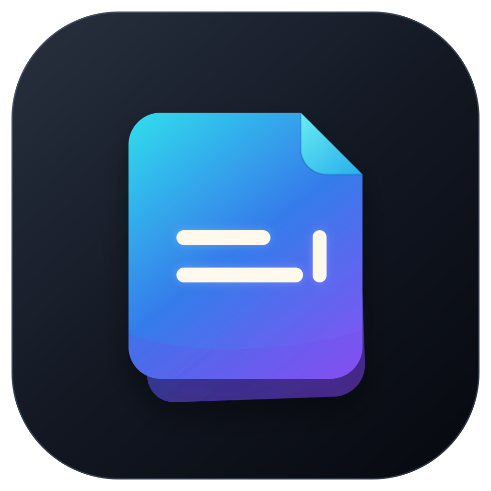

<p align="center">
  
</p>

<h1 align="center">Repotra</h1>

<p align="center">
  原生、轻量、源码保真的 macOS Markdown 笔记与桌面便签。
</p>

<p align="center">
  
  
  
</p>

Repotra 把普通 `.md` 文件作为唯一内容来源，在一个安静的融合式编辑器里完成写作。任意笔记都能钉到桌面成为独立便签，主窗口、便签和快速输入面板共享同一份内容。

> Repotra 仍处于早期开发阶段。目前面向本地构建与体验，尚未提供签名发行包或 Mac App Store 版本。

## 亮点

| | 能力 |
| --- | --- |
| ✍️ | **源码保真编辑**：渲染只改变 TextKit 2 显示属性，不替换 Markdown 字符，不破坏选区与 Undo 坐标。 |
| 👁️ | **融合式 Markdown**：离开当前行后立即渲染；光标回到节点内部时重新显示对应标记。 |
| 📌 | **桌面便签**：一键钉住笔记，支持置顶、位置恢复、字体、背景、透明度、圆角、边框与无标题栏样式。 |
| ⚡️ | **快速记录**：全局 `⌥⌘N` 打开快速笔记面板，无需辅助功能权限。 |
| 🗂️ | **本地资料库**：目录树、全文搜索、重命名、移动、废纸篓、原子保存和外部修改冲突保护。 |
| 🖼️ | **可迁移资源**：粘贴或拖入图片后保存到 `assets/UUID.ext`，整个资料库移动后仍能显示。 |

## Markdown 支持

- GFM 标题、粗体、斜体、删除线、高亮、链接、图片与自动链接
- 引用、嵌套有序/无序列表、任务列表、分隔线和软/硬换行
- 行内代码、围栏代码块、语言提示、语法高亮和一键复制
- 表格、YAML Front Matter、脚注与只读 `[TOC]`
- 选区悬浮格式条、行首 `/` 命令菜单、自动配对和列表续写
- 原始源码模式，以及按窗口隔离的系统 Undo/Redo

数学公式、Mermaid、Wiki Link、标签、双向链接和插件系统暂不在首版范围内。

## 快速开始

### 要求

- macOS 14 或更高版本
- Swift 6.1 或更高版本
- 完整 Xcode（调试应用与运行 XCUITest 时需要）

### 构建可直接打开的应用

```sh
git clone https://github.com/EROQIN/Repotra.git
cd Repotra
Scripts/build-app.sh
open .build/Repotra.app
```

`build-app.sh` 会生成并临时签名 `.build/Repotra.app`，仅供本机开发使用。

### Xcode

仓库包含生成后的工程；`project.yml` 是工程配置来源。

```sh
brew install xcodegen   # 仅首次需要
xcodegen generate
open Repotra.xcodeproj
```

### 测试

```sh
swift test
swift test --package-path Vendor/MarkdownEngine
```

完整 Xcode 安装后，还应运行 `RepotraUITests`，并在 macOS 14 与 15 上完成手动验收。

## 常用快捷键

| 操作 | 快捷键 |
| --- | --- |
| 快速笔记 | `⌥⌘N` |
| 折叠侧栏 | `⌘\` |
| 粗体 / 斜体 / 链接 | `⌘B` / `⌘I` / `⌘K` |
| 删除线 / 高亮 / 行内代码 | `⌘⇧X` / `⌘⇧H` / `⌘⇧C` |
| 段落 / 标题 | `⌘0` / `⌘1…⌘6` |
| 引用 / 代码块 | `⌘⇧Q` / `⌘⇧K` |
| 无序 / 有序 / 任务列表 | `⌘⇧U` / `⌘⇧O` / `⌘⇧T` |
| 插入图片 | `⌘⌥I` |

## 设计与架构

Repotra 使用 SwiftUI 管理应用状态与主界面，编辑区域和桌面便签窗口由 AppKit 提供。Markdown 源码始终是唯一文本存储，文件 I/O、搜索与元数据分别由 actor 隔离。

```text
SwiftUI / AppKit windows
        │
        ├── NoteSession ── shared Markdown source
        ├── MarkdownEngine ── TextKit 2 styling and input
        ├── LibraryStore ── atomic file operations
        ├── SearchIndex ── title, path and body search
        └── MetadataStore ── library and sticky state
```

编辑器基于仓库内固定版本的 [swift-markdown-engine 0.9.0](https://github.com/nodes-app/swift-markdown-engine)，并保留其 Apache 2.0 许可证与上游说明。代码高亮由 HighlighterSwift 提供。

## 资料库结构

```text
My Notes/
├── Note.md
├── assets/                    # 正文图片
└── .repotra/                  # 在文件树和搜索中隐藏
    ├── library.json           # schemaVersion、资料库 UUID、快速笔记路径
    ├── stickies.json          # 便签窗口与外观
    └── backgrounds/           # 便签背景图
```

关闭便签只会取消钉住，不会删除 Markdown 文件；删除笔记时使用 macOS 废纸篓。

## 项目状态与许可

Repotra 当前版本为 `0.1.0`。主项目尚未声明开源许可证，因此默认保留所有权利；`Vendor/` 中的第三方代码继续遵循其各自许可证。发布正式开源版本前应先明确主项目许可证。

欢迎通过 Issues 提交问题与建议。
